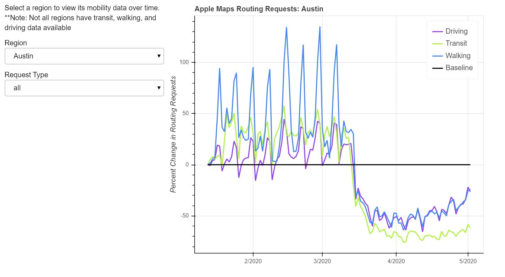
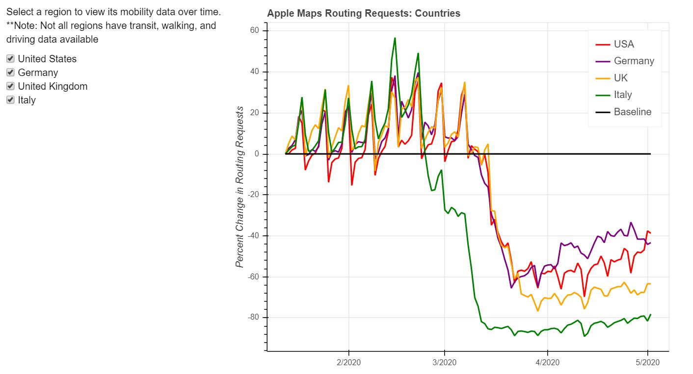

# COVID-19 Apple Mobility Data Visualization Dashboard
> Dana M. Brannon, The University of Texas at Austin

For my final project for CS 329E Elements of Data Visualization, I wanted to analyze and visualize Apple's COVID-19 mobility data to see how the pandemic has affected the movement of people and goods. The most updated version of the dataset can be found [here](https://www.apple.com/covid19/mobility).

## Getting Started

All you need to do to get this code up and running on your own computer is to download the prerequesites (listed below), clone the repository, change into the repo directory, and initialize a jupyter notebook, like so:

```
git clone https://github.com/dmbrannon/datavis_dashboard.git
cd datavis_dashboard
jupyter notebook
```

### Prerequisites

* [jupyter notebooks](https://jupyter.org/install)
* [pandas](https://pandas.pydata.org/pandas-docs/stable/getting_started/install.html)
* [matplotlib](https://matplotlib.org/3.2.1/users/installing.html)
* [bokeh](https://docs.bokeh.org/en/latest/docs/installation.html)

## Graph of Austin Data
### Weekly Average Morning Commute


### Graph of Country Data

